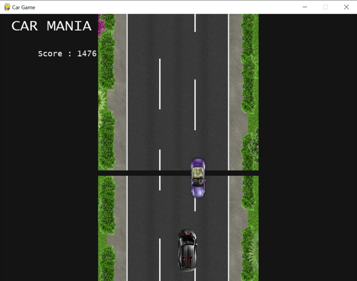
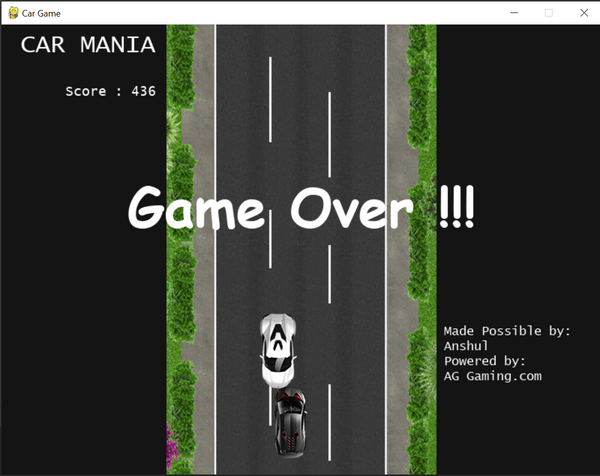
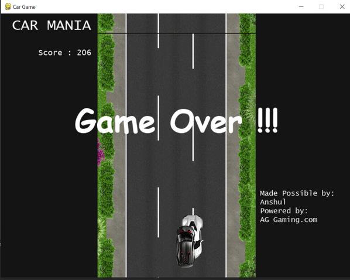
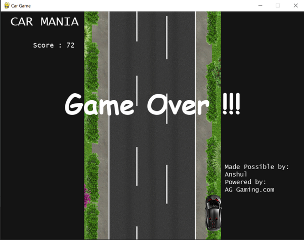

# Car-Game
This is a basic Car Game made just for practising Python programming using pygame library and getting a GUI game.
The objective of the game is to go as long as possible without hitting another car or driving off the road into the bushes.

## Controls
You have to control the black car at the bottom of the screen by pressing the left and right arrow keys. You must press the key in the direction 
you want to go. Holding the key will not have an effect.

## Getting Game Over
Colliding with the other cars in any way will result in a game over.

*Hitting/colliding the car head on *

*Completely going on top/crashing of the car*

## Going Wrong Way
Apart from hitting the other cars, you must also be careful not to drive off the road.

*Driving into the bushes/out of road*

## Dependencies
To run this project, you'll need to install [pygame](https://pypi.org/project/pygame/) module. This can be done with the following command:

    pip install pygame
